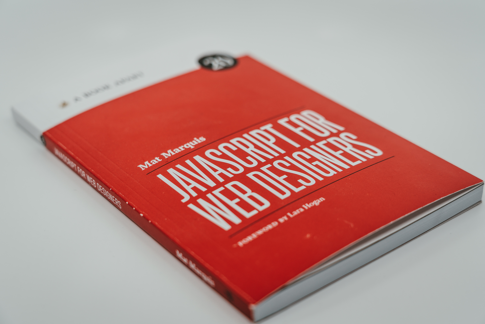

<html>
<head>
  <meta charset="utf-8">
  <TITLE>HTML의 설명</TITLE>
</HEAD>
<body>
<h1><strong><A HREF="https://youngseok1219.github.io/html/">WEB</a></strong></h1>

<ol>
  <li><a href="1.html">HTML</a></li>
  <LI><a href="2.html">CSS</a></li>
  <LI><a href="3.html">JavaScript</a></li>
</ol>

<h2>&nbsp;&nbsp;1.HTML</H2>
  <h3>
&nbsp;&nbsp;&nbsp;&nbsp;HTML은 하이퍼텍스트 마크업 언어(<A href="https://www.w3.org/TR/html51/">HyperText Markup Language</a>, 문화어: 초본문표식달기언어, 하이퍼본문표식달기언어)라는 의미의 웹 페이지를 위한 지배적인 마크업 언어다. HTML은 제목, 단락, 목록 등과 같은 본문을 위한 구조적 의미를 나타내는 것뿐만 아니라 링크, 인용과 그 밖의 항목으로 구조적 문서를 만들 수 있는 방법을 제공한다. 그리고 이미지와 객체를 내장하고 대화형 양식을 생성하는 데 사용될 수 있다. HTML은 웹 페이지 콘텐츠 안의 꺾쇠 괄호에 둘러싸인 "태그"로 되어있는 HTML 요소 형태로 작성한다. HTML은 웹 브라우저와 같은 HTML 처리 장치의 행동에 영향을 주는 자바스크립트와 본문과 그 밖의 항목의 외관과 배치를 정의하는 CSS 같은 스크립트를 포함하거나 불러올 수 있다. HTML과 CSS 표준의 공동 책임자인 W3C는 명확하고 표상적인 마크업을 위하여 CSS의 사용을 권장한다.
 
</h3>
 <h3>
&nbsp;&nbsp;1980년, 유럽 입자 물리 연구소(CERN)의 계약자였었던 물리학자 팀 버너스리가 HTML의 원형인 인콰이어를 제안하였다. 인콰이어는 CERN의 연구원들이 문서를 이용하고 공유하기 위한 체계였다. 1989년에 팀 버너스리는 인터넷 기반 하이퍼텍스트 체계를 제안하는 메모를 작성했다.[2] 버너스 리는 1990년 말에 HTML을 명시하고, 브라우저와 서버 소프트웨어를 작성했다. 그 해에 버너스리와 CERN 데이터 시스템 엔지니어 로버트 카일리아우와 함께 CERN측에 자금 지원을 요청하였지만, 이 프로젝트는 CERN으로부터 정식으로 채택 받지 못했다. 버너스리의 개인적인 기록에 1990년부터 "하이퍼텍스트가 사용되는 여러 분야의 일부"를 열거했고 백과사전을 그 목록의 첫 번째로 두었다.
</h3>

<h2>&nbsp;&nbsp;2.CSS</h2>
  <h3>
&nbsp;&nbsp;&nbsp;&nbsp;종속형 시트 또는 캐스케이딩 스타일 시트(Cascading Style Sheets, CSS)는 마크업 언어가 실제 표시되는 방법을 기술하는 언어로, HTML과 XHTML에 주로 쓰이며, XML에서도 사용할 수 있다. W3C의 표준이며, 레이아웃과 스타일을 정의할 때의 자유도가 높다. 마크업 언어가 웹사이트의 몸체를 담당한다면 CSS는 옷과 액세서리 같은 꾸미는 역할을 담당한다고 할 수 있다. 즉, HTML 구조는 그대로 두고 CSS 파일만 변경해도 전혀 다른 웹사이트처럼 꾸밀 수 있다. 현재 개발 중인 CSS3의 경우 그림자 효과, 그라데이션, 변형 등 그래픽 편집 프로그램으로 제작한 이미지를 대체할 수 있는 기능이 추가되었다. 또한 다양한 애니메이션 기능이 추가되어 어도비 플래시를 어느 정도 대체하고 있다.
   
  
</h3>
   
  <h3>
CSS는 지속적으로 새로운 버전이 나오고 있다. 1996년에 도입된 CSS 1은 CSS의 바탕이 되었다. CSS의 표준으로는 CSS 2.1이 있으며 이전 버전에 비하여 새로운 기능과 도구가 추가되었다. 대다수의 웹 브라우저는 CSS 2.1를 잘 지원한다.(인터넷 익스플로러의 경우, 버전 7이 되면서 CSS2.1을 지원한다.) 현재 W3C에서는 CSS3을 표준으로 만들고 있다. CSS는 여러 수준과 프로파일을 가지고 있다. 각 수준의 CSS는 일반적으로 새로운 기능을 담고 있으며 CSS1, CSS2, CSS3, CSS4로 나뉜다. 프로파일들은 일반적으로 특정한 장치나 사용자 인터페이스를 위해 만들어진 하나 이상 수준의 CSS의 하부 집합이다. 현재 휴대용 장치, 프린터, 텔레비전 수상기를 위한 프로파일들이 있다.
</h3>

<h2>&nbsp;&nbsp;3.JaveScript</H2>
  <h3>
&nbsp;&nbsp;&nbsp;&nbsp;자바스크립트(영어: JavaScript)는 객체 기반의 스크립트 프로그래밍 언어이다. 이 언어는 웹 브라우저 내에서 주로 사용하며, 다른 응용 프로그램의 내장 객체에도 접근할 수 있는 기능을 가지고 있다. 또한 Node.js와 같은 런타임 환경과 같이 서버 사이드 네트워크 프로그래밍에도 사용되고 있다. 자바스크립트는 본래 넷스케이프 커뮤니케이션즈 코퍼레이션의 브렌던 아이크(Brendan Eich)가 처음에는 모카(Mocha)라는 이름으로, 나중에는 라이브스크립트(LiveScript)라는 이름으로 개발하였으며, 최종적으로 자바스크립트가 되었다. 자바스크립트가 썬 마이크로시스템즈의 자바와 구문이 유사한 점도 있지만, 이는 사실 두 언어 모두 C 언어의 기본 구문에 바탕을 뒀기 때문이고, 자바와 자바스크립트는 직접적인 관련성이 없다. 이름과 구문 외에는 자바보다 셀프나 스킴과 유사성이 많다. 2013년 1월 기준으로, 가장 최근 버전은 자바스크립트 1.8.5이고[3], 파이어폭스 3에서 지원된다. 표준 ECMA-262 3판에 대응하는 자바스크립트 버전은 1.5이다. ECMA스크립트는 쉽게 말해 자바스크립트의 표준화된 버전이다. 모질라 1.8 베타 1이 나오면서 XML에 대응하는 확장 언어인 E4X(ECMA-357)를 부분 지게rhl었다. 자바스크립트는 브라우저마다 지원되는 버전이 다르다.
     
</h3>
  <h3>
1993년, 일리노이 대학교 어배너-섐페인의 NCSA는 최초의 대중적인 그래픽 웹 브라우저인 NCSA 모자이크를 출시하였다. 1994년, 모자이크 커뮤니케이션스라는 이름의 회사가 캘래포니아주 마운틴 뷰에 설립되었으며 모자이크 넷스케이프를 만들기 위해 오리지널 NCSA 모자이크 개발자들을 고용하였다. 그러나 NCSA 모자이크와 코드는 의도적으로 공유하지 않았다. 이 기업의 브라우저의 내부 코드명은 모질라였으며 이는 "Mosaic and Godzilla"에서 비롯된 용어이다. 이 웹 브라우저의 첫 버전인 모자이크 넷스케이프 0.9는 1994년 말에 출시되었다. 4개월 후 브라우저 시장의 3/4를 잠식하면서 1990년대에 주된 웹 브라우저가 되었다.  NCSA의 상표 소유권 문제를 회피하고자 이 브라우저는 같은 해에 "넷스케이프 내비게이터"로 이름을 바꾸었으며 이 기업은 "넷스케이프 커뮤니케이션스"라는 이름을 취하였다. 넷스케이프 커뮤니케이션스는 웹이 더 동적으로 변화할 필요가 있었음을 실감했다. 기업의 설립자 Marc Andreessen은 HTML에 코드를 웹 페이지 마크업으로 직접 작성하면서 웹 디자이너들과 파트타입 프로그래머들이 이미지, 플러그인 등의 요소를 쉽게 조합할 수 있는 글루 언어(glue language)가 필요했다고 믿었다. 1995년, 넷스케이프 커뮤니케이션스는 스킴 프로그래밍 언어를 넷스케이프 내비게이터에 임베디드하기 위해 브렌던 아이크를 영입하였다. 시작 전에 넷스케이프 커뮤니케이션스는 넷스케이프 내비게이터 썬의 더 정적인 프로그래밍 언어인 자바를 포함시키기 위해 썬 마이크로시스템즈와 협업했으며 이는 사용자에게 웹 기술 및 플랫폼을 채택시키려는 마이크로소프트와 경쟁하기 위해서였다. 넷스케이프 커뮤니케이션스는 이때 자신들이 만들기 바랐던 스크립트 언어가 자바를 구현할 것이고 비슷한 문법을 채용하는 것이 좋겠다고 생각했으며 펄, 파이썬, Tcl, 스킴 등 기타 언어를 채택하는 것을 배제하였다.  경쟁적인 제안에 대항하여 자바스크립트 개념을 방어하기 위해 이 기업은 프로토타입이 필요했다. 아이크는 1995년 5월 10일 안에 이를 작성했다. 원래 모카(Mocha)라는 이름으로 개발되었으나 이 언어는 공식적으로 라이브스크립트(LiveScript)로 불렸으며 이 당시 1995년 9월 넷스케이프 내비게이터 2.0의 베타 릴리스가 이루어졌으나 나중에 이름이 자바스크립트로 바뀌었는데 이는 12월 넷스케이프 내비게이터 2.0 베타 3에 채용되었다. 이름의 최종 선정에 혼란이 야기되었는데 이 언어가 자바 프로그래밍 언어에서 파생되었다는 인상을 심었으며 이러한 선택이 마케팅적인 특징을 보였고 이는 넷스케이프가 당시 인기있는 웹 프로그래밍 언어로서 자바스크립트를 내밀기 위한 것이었다. 라이브스크립트의 이름이 자바스크립트로 변경된 것은 대략 넷스케이프가 자사의 넷스케이프 내비게이터 웹 브라우저에 자바 기술에 대한 지원을 포함하기 시작할 즈음이다.  자바스크립트는 1995년 12월 출시된 넷스케이프 2.0B3에서부터 공개, 채택되었다. 자바스크립트라는 이름은 상당한 혼란을 가져왔다. 이것은 자바와 자바스크립트 간에는 구문이 유사하다는 점(양쪽 모두 C에 바탕을 두었기 때문에) 외에는 실제 관련성이 없었기 때문이다. 두 언어는 의미론적으로 매우 다르고, 특히 각각의 객체 모델은 관련성이 없는 데다가 상당 부분이 호환되지 않는다. 웹 페이지 향상 언어로서 자바스크립트의 성공에 자극받은 마이크로소프트는 J스크립트로 알려진 호환 언어를 개발하게 되었다. J스크립트는 1996년 8월에 출시된 인터넷 익스플로러 브라우저 3.0부터 지원 되기 시작했다. IE 브라우저에서의 자바스크립트 사용은 실제로는 J스크립트의 사용을 의미하는 것이었다. 이에 대한 표준화 요구는 ECMA스크립트에 대한 ECMA-262 표준의 기반이 되었으며, 1996년 11월 이후 세 번째 판까지 출판됐다. 자바스크립트와 함께 자주 쓰이는 용어인 DOM은 사실 ECMA스크립트 표준의 일부가 아니며, 그것은 자체로 하나의 표준이고 XML에 기qks을 둔다.
</h3>

</body>
</html>
